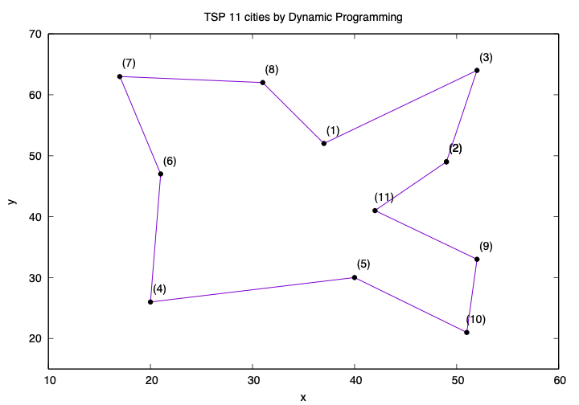

# Traveling Salesman Problem 11-cities Solved with Dynamic Programming
## Package
gnuplot

## Usage
Open terminal
Get the optimal order
```
make
./search dp readfile.txt
```
Plot the result:
```
make plot
```
For live plotting:
```
make plot_animation
```
Press 'q' to quit gnuplot

## Results


